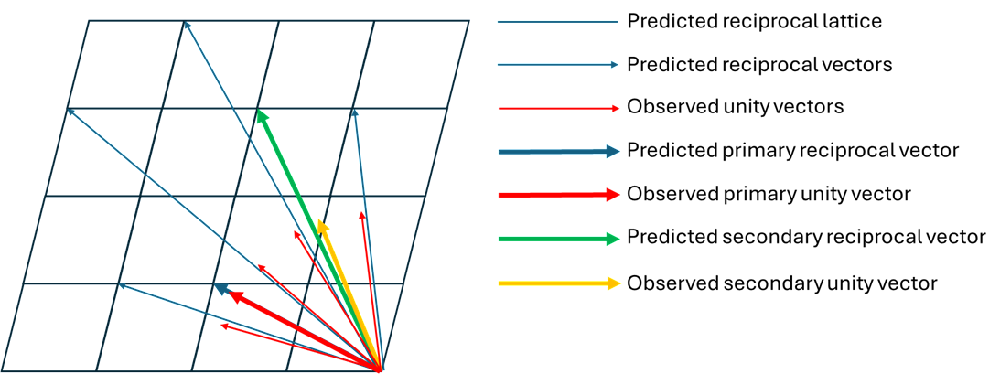
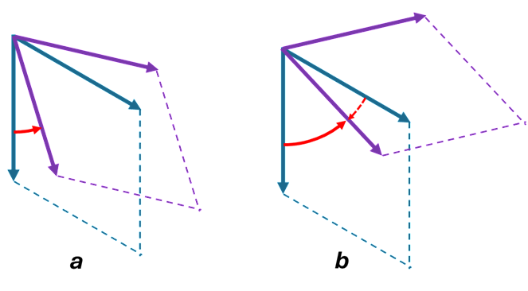

# Algorithms for Indexing and Tracking

These functions are written in Python 3.11 [15]. Both indexing and tracking
include checking a huge number of possible combinations between observed and
predicted reciprocal vectors until the correct combination is found. In the
software used previously, these procedures were implemented by iterating with
Python loops, which made processing the data from multigrain samples quite
time consuming [1-9]. In PolyLaue, broadcasting of arrays in NumPy 1.26 is
used instead of Python loops, which makes these routines multiple orders of
magnitude faster [12,16].

The first steps, common to both the indexing and tracking routines, are:

- Estimation of the smallest possible limit of the d-value,
  dmin, of a reflection that can be present in a Laue pattern,
  based on the highest limit of X-ray energy and the largest 2θ angle that
  can be recorded by the area detector. *A more realistic dmin,
  defined by the scattering power of a sample, can be specified by the user
  based on their previous experience.*
- Based on the unit cell parameters, the software generates a listing of all
  possible reciprocal vectors shorter than 1/dmin. Only reciprocal
  vectors having indices that are relatively prime integers are included in
  the listing.

## Indexing of Laue Reflections

This routine is used to index Laue reflections produced by the same
crystalline grain within a multigrain sample, based on two observed Laue
spots, called primary and secondary [17]. The primary reflection is selected
by the user. The set of secondary reflections can be either specified by the
user or found automatically with the PolyLaue peak search function. The
indexation routine tests secondary spots, one after another, in order to find
a reflection produced by the same grain as the one that produced the primary
reflection.

Observed Laue spots yield a listing of unity vectors parallel to their
reciprocal vectors. All possible combinations of two reciprocal vectors, from
the list generated before indexing, are tested by making these vectors
parallel to the unity vectors of the primary and secondary reflections. As
soon as the correct combination is used, the unity vectors of other Laue
spots produced by the same crystal match their predicted reciprocal vectors
(Fig. 1). Due to experimental errors, there are discrepancies between the
reciprocal vectors from the list and the observed unity vectors. The primary
unity vector is set parallel to its predicted reciprocal vector, while the
predicted secondary reciprocal vector is constrained to lie in the plane of
the observed primary and secondary unity vectors.

<figure markdown="span" class=diagram>
  { width="820" }
</figure>

**Fig. 1.** Match between predicted reciprocal vectors, lying in the plane
including the primary and secondary vectors, and observed unity vectors, as
projected onto the same plane.

Although the listing of predicted reciprocal vectors generated by this
routine refers to an arbitrary frame, the observed unity vectors are saved
with respect to the area detector. Therefore, the correct combination of
primary and secondary predicted reciprocal vectors yields the crystal
orientation with respect to the area detector coordinate frame.

This routine yields multiple equivalent solutions for the same grain, due to
the symmetry of translation lattices. Therefore, the multiplicity, which is
the number of equivalent solutions, must match one of those listed in
Table 1.

**Table 1.** Multiplicity versus symmetry of the translation lattice.

| Symmetry           | Multiplicity |
| ------------------ | ------------ |
| Cubic              | 24           |
| Hexagonal/Trigonal | 12           |
| Rhombohedral       | 6            |
| Tetragonal         | 8            |
| Orthorhombic       | 4            |
| Monoclinic         | 2            |
| Triclinic          | 1            |

Even when a wrong combination of predicted primary and secondary reciprocal
vectors is used, there is typically still some number of predicted vectors
coincident with the observed unity vectors. However, the number of such
coincident vectors will be much smaller compared to using the correct
combination. The parameter Reflections Threshold is used to reject those
wrong solutions.

When this routine is running, all possible combinations of primary and
secondary reciprocal vectors are stored in memory as two NumPy arrays,
`ndarray` objects. Therefore, if these arrays are too large, the indexation
routine may fail due to a lack of memory. Repeating this routine with a
somewhat larger value of Resolution Limit (dmin) may solve the
problem. Otherwise, the option Conserve Memory can be used in order to check
all possible combinations of primary and secondary vectors by running two
loops instead of generating `ndarray` objects. Using this option saves memory
but makes the indexation routine more time consuming.

## Tracking of Crystals

This routine (function track() in the Python script) is used to track
angular shifts of crystalline grains within a multigrain sample caused by
shrink of gasket material across compression in diamond anvil cells.
Increase of pressure typically causes movement of sample in particular when
sample is on contact with gasket material either directly or via Ruby balls,
pieces of standard materials used to measure pressure, other samples.

Apart from indexing routine, which does not require any preliminary
knowledge of crystal orientation, tracking routine is based on crystal
orientation found at different pressure, either at higher or lower one.
Therefore, tracking algorithm has the following differences from indexing.

- Listing of predicted reciprocal vectors is generated based on predefined
  orientation matrix obtained at different pressure. Only vectors deviating
  from observed unity vectors within Angular Limit are included in the list.
- Instead of using only one primary reflection all possible combinations of
  observed primary and secondary reflections are included into the routine
  [17]. Combination which yields the best match between predicted reciprocal
  and observed unity vectors is used to calculate crystal orientation.
  Therefore, this routine is also used to refine orientation of a crystal at
  the same pressure if pair of primary and secondary reflections used during
  indexing does not provide enough precision.

If Angular Limit is more than 30°, incorrect shift may be determined due to
symmetry of translation lattice (Fig. 2). If a hexagonal or trigonal crystal
may be rotated about c-axis by angle of more than 30° and, as tracking is
based only on translation lattice without use of space group, two angular
shifts can be detected by tracking routine within the Angular Limit, but
only one of them will be correct. Translation lattices of other symmetries
have larger angular thresholds for such uncertainties.

Even if total rotation during compression is larger than 30˚, in general,
this issue still can be avoided, even for hexagonal/trigonal lattices, if
angular shift with respect to crystal orientation obtained at pressure right
below or above the current one is smaller than 30˚. In this case, if option
‘Use nearest tracked scan for reference ABC matrix’ is active, crystal
orientation obtained at closest pressure to the current one will be used for
tracking.

If multigrain sample is shifting as a rigid body, angular shifts determined
for one grain of sample can be applied to other grains of the same sample
without the need to track other grains separately.

<figure markdown="span" class=diagram>
  { width="663" }
</figure>

**Fig. 2.** Angular shifts, red arrows, of a hexagonal/trigonal lattice
about c-axis by less than 30° (a) and by more than 30° (b). Incorrect
angular shift may be found: dotted red arrow.

When this routine is running, all possible combinations of primary and
secondary vectors are stored in memory as two NumPy arrays, ndarray objects.
Therefore, if these arrays are too large, the indexation routine may fail
due to the lack of memory. Repeating this routine with somewhat larger value
of Resolution Limit (dmin) may solve the problem. Otherwise, option Conserve
Memory can be used (function track_py() in the Python script) in order to
check all possible combinations of primary and secondary vectors by running
of two included cycle loops instead of generating ndarray objects. Using
this option saves memory but makes the indexation routine more time
consuming.
