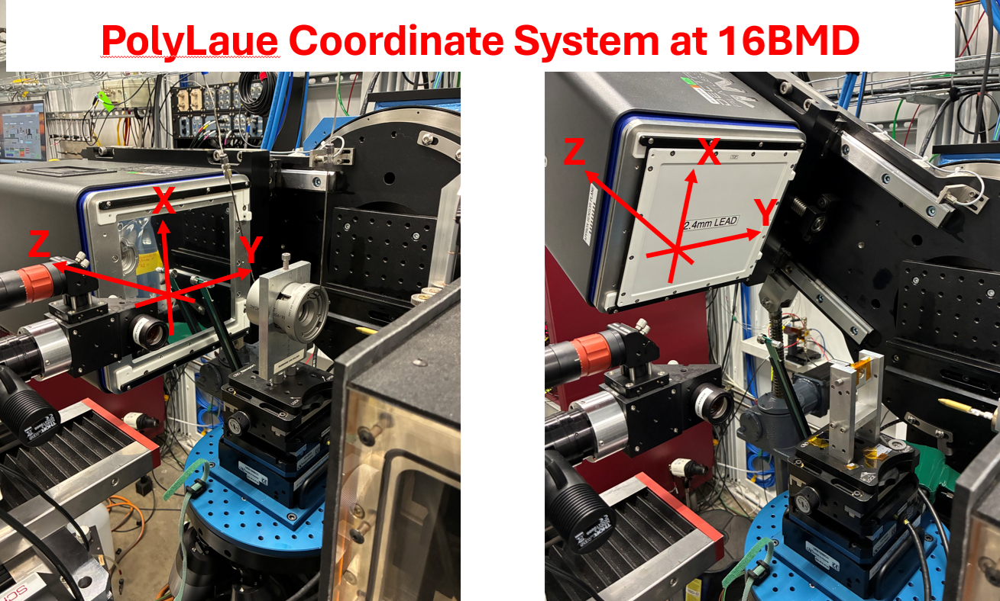
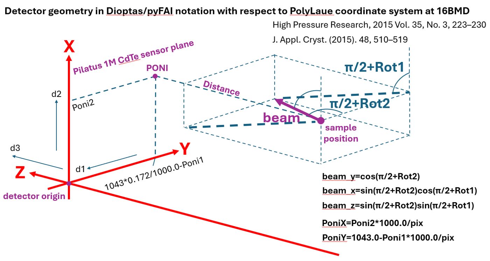
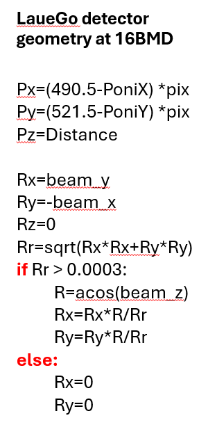

# Calibrating Detector Geometry

In HPCAT detector geometry is calibrated using X-ray monochromatic beam
exchangeable with the white beam. Program Dioptas is used to get detector
tilt, sample to detector distance and point of normal incidence (PONI)
[18,19]. Calculations in PolyLaue are conducted with respect to coordinate
frame attached to the area detector (Fig. 3). Relations between parameters
saved in poni-files by Dioptas and orientation of incident beam, PONI and
sample to detector distance in the notation of PolyLaue, saved in the
project geometry file (`geometry.npz`), are presented in Fig. 4. Further
transferring of detector geometry to the format of LaueGo is presented in
Fig. 5.

<figure markdown="span" class=diagram>
  { width="820" }
</figure>

**Fig. 3.** The PolyLaue coordinate system at 16BMD.

<figure markdown="span" class=diagram>
  { width="820" }
</figure>

**Fig. 4.** Detector geometry in Dioptas/pyFAI notation with respect to
the PolyLaue coordinate system at 16BMD.

<figure markdown="span" class=diagram>
  { width="300" }
</figure>

**Fig. 5.** Transferring of detector geometry from PolyLaue to LaueGo at
16BMD [13,14].

## Importing the geometry into PolyLaue

Three experimental setups have been used in HPCAT to collect high
pressure Laue data one after another, and the conversion from the
PONI file differs between them (in how the white beam shift is applied
to the point of normal incidence). PolyLaue converts PONI files
directly: select the `.poni` file in the **Geometry** field of the
project editor and choose the setup in the dialog that follows, as
described in [Projects, Sections, and Series](projects.md#importing-a-poni-file-as-the-geometry):

- **16BMD**: the setup currently available at 16BMD (the default);
- **16BMB (2016-2023)**: the setup which was available at 16BMB from
  2016-3 until 2023-1 [6];
- **16BMB (before 2016)**: the setup which was available at 16BMB
  until 2016-2 [8].

The same conversions are also available as standalone Python scripts
(`PolyLaue_16BMD_detector_geometry.py`,
`PolyLaue_16BMB_detector_geometry_after_2016.py`, and
`PolyLaue_16BMB_detector_geometry_until_2016.py`) at
<https://github.com/dmitrypopo1/PolyLaue>, which read `poly.poni` and
write `geosetup.npz`. A geometry file produced this way, or by any
other means for a different beamline, can be selected directly in the
**Geometry** field.

The relations between detector geometry notation as saved in poni-file and
as used by PolyLaue have been carefully verified using version 0.8.5 of
Dioptas.
