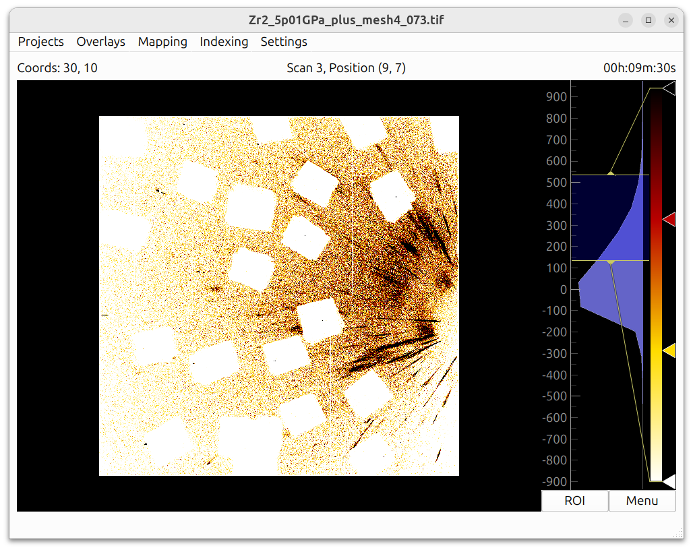

# PolyLaue

PolyLaue is a software package for analyzing Laue diffraction data collected
*in-situ* and *en-operando*. Its primary goal is identifying and tracking
selected crystals within a multigrain sample during compression in diamond
anvil cells (DAC). It is developed by [Kitware](https://www.kitware.com) in
collaboration with the High-Pressure Collaborative Access Team (HPCAT) at the
Advanced Photon Source of Argonne National Laboratory.

<figure markdown="span" class="hero">
  { width="820" }
</figure>

-   :material-download:{ .lg .middle } __Getting Started__

    ---

    Install PolyLaue with conda and take the first steps.

    [:octicons-arrow-right-24: Getting Started](getting-started.md)

-   :material-folder-multiple:{ .lg .middle } __Projects, Sections, and Series__

    ---

    Organize your scans and set up the detector geometry.

    [:octicons-arrow-right-24: Projects](projects.md)

-   :material-image-search:{ .lg .middle } __Viewing Data__

    ---

    Navigate scans, frame times, coordinates, and live acquisition.

    [:octicons-arrow-right-24: Viewing Data](viewing.md)

-   :material-crystal-ball:{ .lg .middle } __Identifying and Tracking Crystals__

    ---

    Map a crystal of interest, find its orientation, and track it across scans.

    [:octicons-arrow-right-24: Identifying and Tracking](identification.md)

-   :material-grid:{ .lg .middle } __Mapping__

    ---

    Build maps of regions and of specific HKL reflections across a scan.

    [:octicons-arrow-right-24: Mapping](mapping.md)

-   :material-function-variant:{ .lg .middle } __Algorithms__

    ---

    How the indexing and tracking routines work.

    [:octicons-arrow-right-24: Algorithms](algorithms.md)

## What PolyLaue can do

- Direct observation of parent/product or liquid/solid interface propagation
  in 2D
- Determination of product or twin variants after phase transitions and
  deformational twinning
- Observation of the formation and redistribution of strain and defects of the
  crystal lattice due to pressure-induced processes, including elastic/plastic
  deformation, phase transitions, melting, and crystallization

PolyLaue was developed to replace software that was used previously [1-9].
Results are saved in HDF5 format, as ASCII files, and as NumPy arrays, so they
can be used by other programs [10]. See the [References](references.md) page
for the numbered citations used throughout this documentation.

## System Requirements

- **Operating system:** Windows, macOS, or Linux
- **Python:** version 3.11 or newer (installed automatically when using
  conda)
- **Memory:** requirements depend on the size of the data and the
  indexing settings. If the indexing routine fails due to a lack of
  memory, see the notes on the *Resolution Limit* and *Conserve Memory*
  options in [Algorithms](algorithms.md).
- **Storage:** the scan images must be available on a locally accessible
  filesystem.

All other dependencies are installed automatically. See
[Getting Started](getting-started.md) for installation instructions.

!!! tip "Tooltips"

    Very detailed tooltips are available if you hover the mouse over an item
    of the interface. The information in these tooltips is not duplicated in
    this documentation.

!!! note

    At the 16BMD beamline of HPCAT, high pressure Laue data can also be
    analyzed with the LaueGo software, in parallel with PolyLaue [11,12].
