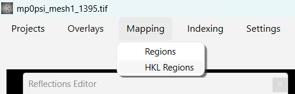
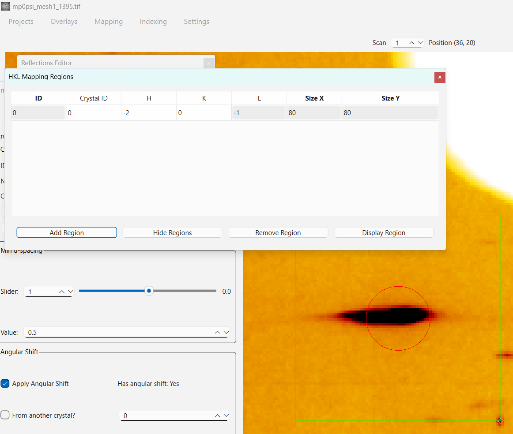
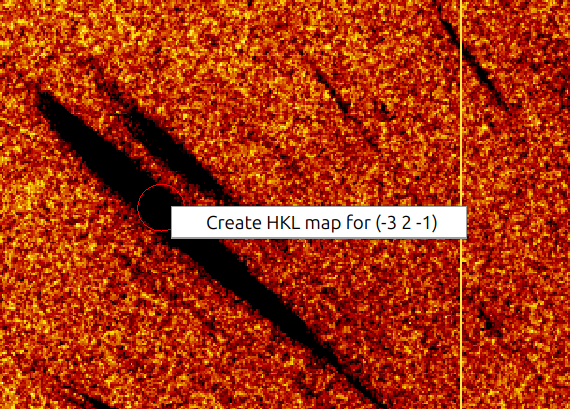
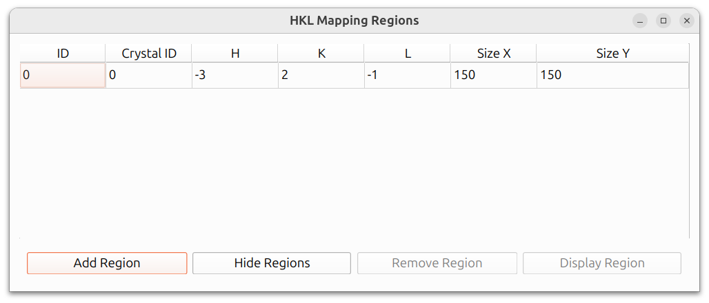
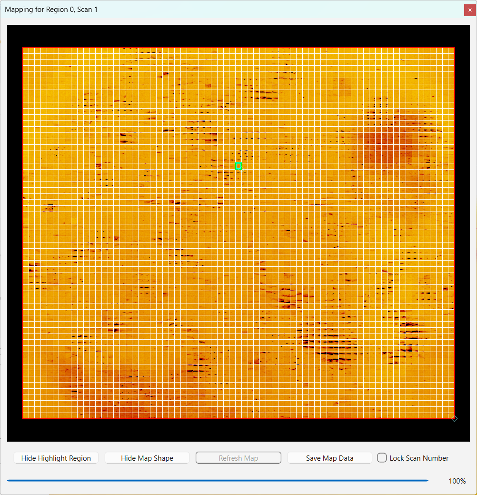
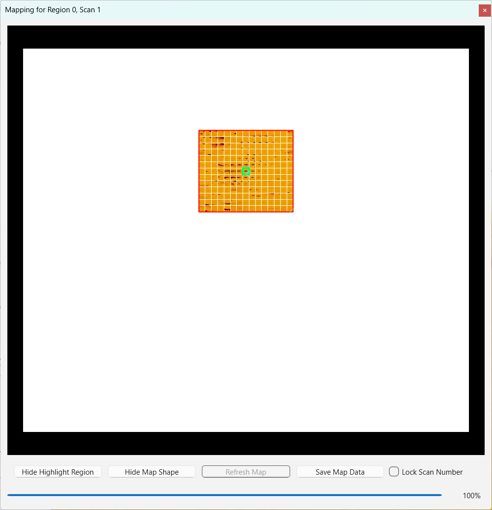
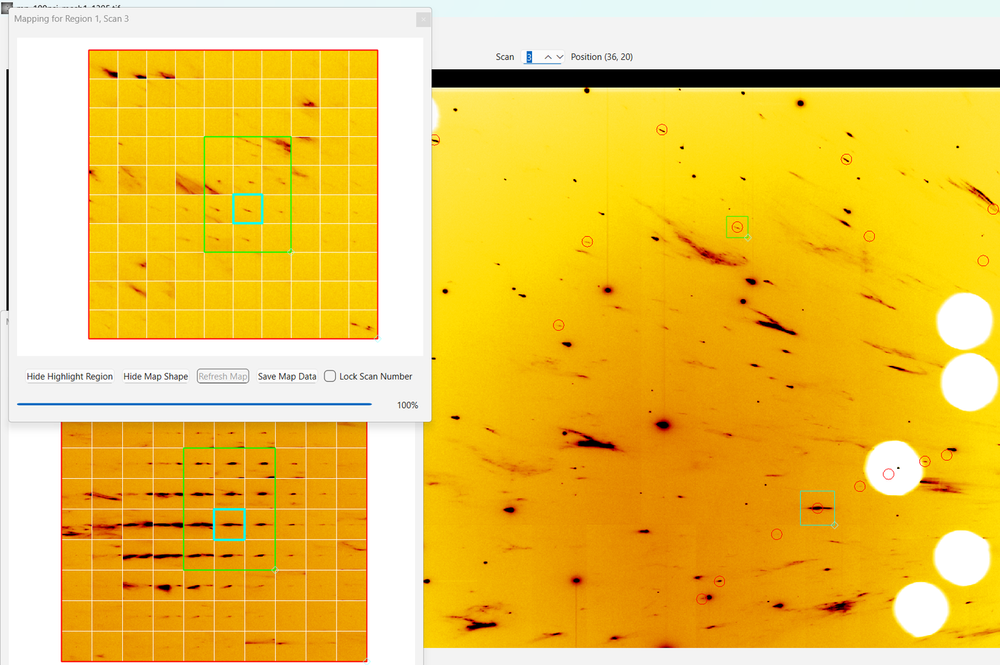
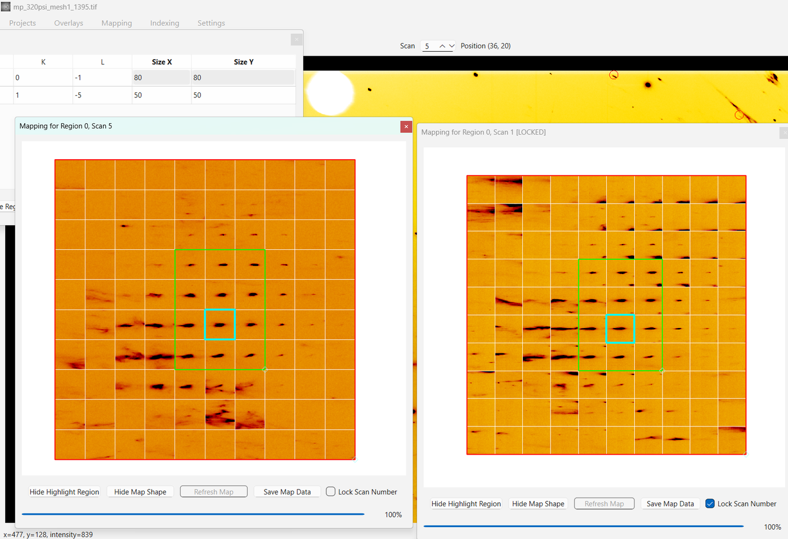

# Mapping

PolyLaue can build maps of a small region of the frames across all scan
positions, which is useful for visualizing how a reflection (or any
region of interest) evolves across a scan.

## Region maps

Open **Mapping → Regions** to manage plain rectangular regions. Click
**Start Interactive Add** and draw regions directly on the image, then
click **Stop Interactive Add** when finished. Select a region and click
**Display Region** to open a map of that region across the scan. See
[Identifying and Tracking Crystals](identification.md#mapping-of-laue-reflections)
for a walkthrough.

## HKL region maps

Open **Mapping → HKL Regions** to manage regions that are tied to a
specific reflection: each entry has a crystal ID and an HKL, and the
region automatically re-centers itself on that reflection's predicted
position whenever the scan number changes. Predicted reflections must be
loaded (see [Predicted Reflections](reflections.md)) for HKL regions to
resolve their positions.

<figure markdown="span">
  { width="499" }
  <figcaption>HKL Regions in the Mapping menu</figcaption>
</figure>

There are two ways to add an entry:

- Click **Add Region**, then input the HKL indices and adjust the box
  size in the table. The region appears on the image as soon as the HKL
  can be resolved for the current scan.
- **Right-click a predicted reflection** on the image and choose
  *Create HKL map for (h k l)*. This opens the HKL Regions dialog and
  adds an entry for that reflection's crystal ID and HKL, centered on
  the reflection.

<figure markdown="span">
  { width="820" }
  <figcaption>An HKL region in the table</figcaption>
</figure>

<figure markdown="span">
  { width="570" }
  <figcaption>Right-clicking a predicted reflection</figcaption>
</figure>

<figure markdown="span">
  { width="820" }
  <figcaption>The entry added by the right-click menu</figcaption>
</figure>

Click Display Region.

<figure markdown="span">
  { width="560" }
  <figcaption>The map of an HKL region</figcaption>
</figure>

Adjust Map Shape.

<figure markdown="span">
  { width="560" }
  <figcaption>Adjusting the map shape</figcaption>
</figure>

Watch maps of multiple reflections simultaneously while moving through
different scans.

<figure markdown="span">
  { width="820" }
  <figcaption>Maps of multiple reflections</figcaption>
</figure>

By locking scan number maps of the same reflection from different scans can
be compared.

<figure markdown="span">
  { width="820" }
  <figcaption>Comparing maps of the same reflection from different scans</figcaption>
</figure>

As typically there are multiple elements of the table with the same crystal
ID even within the same scan, average x,y position from all of the elements
within the same scan is used to build an HKL-map for that scan.

If the HKL cannot be found on a scan (the crystal is not tracked there,
or the reflection is absent), the region keeps its last known position:
its outline is hidden on the image, its cells turn red in the table, and
the map window shows "HKL not found on scan N" instead of a map. The map
is rebuilt as soon as a scan where the HKL exists is shown again.

## Map windows

Clicking **Display Region** opens a map window for the selected region.
**Show Map Shape** draws a rectangle in the map window marking the scan
positions being mapped, which can be adjusted, and **Save Map Data** saves the current map as a NumPy array
(see [Saving and Loading Data](saving-data.md#maps)).

A map window can be locked to its current scan number with the **Lock
Scan Number** checkbox, so that maps of the same region at different
scan numbers can be compared side by side; displaying the region again
then opens an additional, unlocked window.
