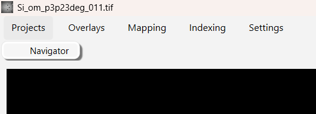
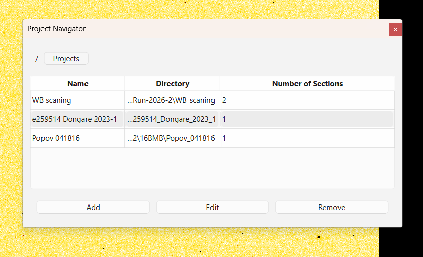
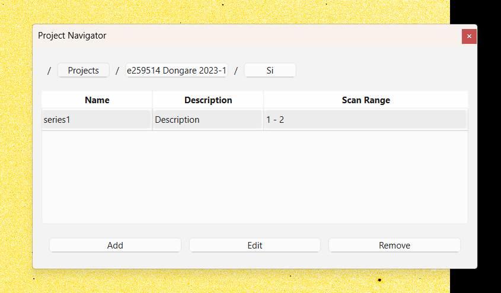
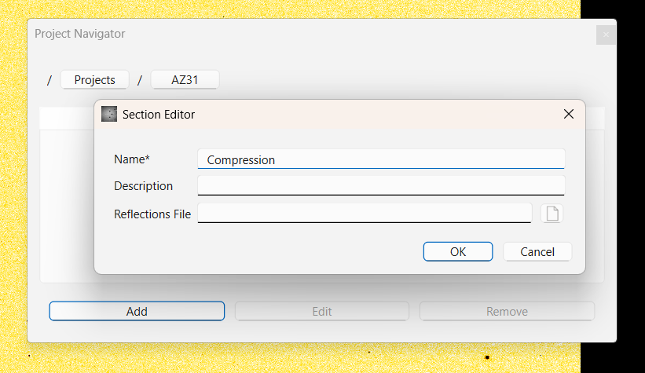
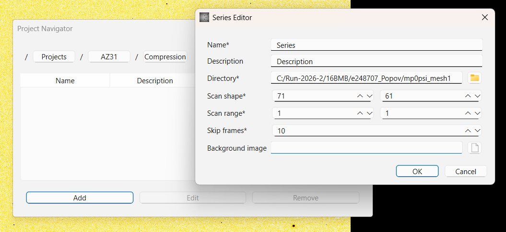
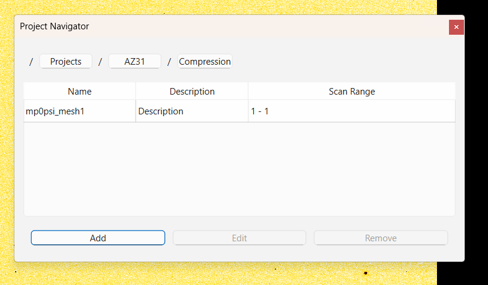
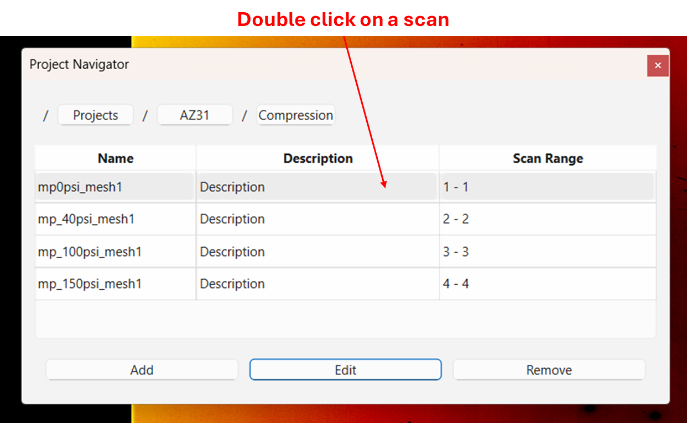
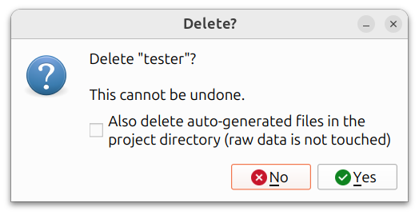

# Projects, Sections, and Series

PolyLaue organizes data in a three-level hierarchy:

- A **project** corresponds to one experimental setup. It stores the
  detector geometry, the x-ray energy range, and a *project directory*
  where PolyLaue automatically creates and stores files (such as
  predicted reflections and coordinate selections).
- A **section** groups related series within a project, and stores the
  predicted reflections and the acquisition time intervals for those
  series.
- A **series** points to a directory of scan images on disk, and
  describes their layout (scan shape, scan number range, and frames to
  skip).

The raw scan images always stay in their own directories. PolyLaue
never writes into them.

## The navigator

Open the navigator via **Projects → Navigator**.

Open the navigator via **Projects → Navigator**. The navigator shows one
level of the hierarchy at a time:

- **Double-click** a project or section to descend into it (double-click
  a series to open it in the main window).
- Use the navigation bar at the top to move back up.
- Use the **+** (add), pencil (edit), and **-** (remove) buttons, or
  right-click an entry, to create, edit, or delete entries at the
  current level.

## Creating a project

Click the add button at the root level of the navigator and fill in the
fields:

!!! warning "FIXME: add screenshot"

    The Project Editor dialog, filled in for a real project, with the Geometry field pointing at a `.poni` or `.npz` file (the draft's screenshot says "geosetup.npz must be created separately", which is no longer true).

- **Name**: a unique name for the project.
- **Description** (optional): free text for personal records.
- **Directory**: the project directory. PolyLaue automatically creates
  and stores files here (predicted reflections, coordinate selections,
  geometry, maps). Choose an empty directory. PolyLaue warns if the
  chosen directory is not empty.
- **Frame Shape**: the shape of the data frames, in pixels.
- **Energy Range**: the energy range of the x-ray beam, in keV.
- **Geometry** (optional): the detector geometry, needed for predicting
  reflections. Either a PolyLaue geometry file (NPZ format), which is
  copied into the project directory as `geometry.npz`, or a **PONI
  file** to import (see below).
- **Minimum Find/Tracking Resolution Limits**: guard rails that prevent
  accidentally running find or track with a resolution limit that is
  too low (which may cause the algorithm to run for a very long time).

## Importing a PONI file as the geometry

Instead of an NPZ geometry file, the **Geometry** field also accepts a
`*.poni` file (as produced by Dioptas/pyFAI calibration). When a PONI
file is selected and the project editor is accepted with **OK**:

1. The PONI file is parsed and converted, using the project's frame
   shape, and the geometry is written to `geometry.npz` in the project
   directory.
2. A dialog then pops up showing the imported parameters (pixel size,
   sample-detector distance, Poni1/Poni2, Rot1/Rot2), which may be
   reviewed and edited. Accepting the dialog writes the (possibly
   edited) parameters; canceling it keeps the parameters exactly as
   parsed from the PONI file.

The dialog also has a **Detector Setup** selector. Three setups have
been used at HPCAT to collect Laue data, and they differ in how the
white beam shift is applied to the point of normal incidence:

- **16BMD**: the current setup (the default),
- **16BMB (2016-2023)**: the setup available at 16BMB from 2016-3
  until 2023-1,
- **16BMB (before 2016)**: the setup available at 16BMB until 2016-2.

The conversion is only valid for these setups. For data collected at
other beamlines, prepare the geometry NPZ file externally and select it
in the **Geometry** field instead.

If the PONI file cannot be parsed, a validation error is shown and
nothing is written.

FIXME: add screenshot of the "Imported PONI Geometry" dialog after
selecting a `.poni` file, showing the Detector Setup dropdown and the
six parsed values (the Sep 3 email screenshot predates the dropdown).

## Creating a section

Section includes multiple series of two-dimension (2D) scans collected one
after another.

Inside a project, click the add button and fill in the fields:

- **Name**: a unique name for the section.
- **Description** (optional): free text for personal records.
- **Reflections File** (optional): a PolyLaue reflections file (HDF5),
  copied into the section directory as `reflections.h5`. If one is not
  provided, this file is generated automatically when predicting
  reflections.

Each section gets its own subdirectory under `Sections/` in the project
directory, created automatically.

## Creating a series

Inside a section, click the add button and fill in the fields:

- **Name**: a unique name for the series.
- **Description** (optional): free text for personal records.
- **Directory**: the directory containing the scan images of this
  series. The contents are validated against the settings below,
  including the expected number of images.
- **Scan shape**: the shape of the scans within this series.
- **Scan range**: the range of scan numbers in this series (inclusive).
- **Skip frames**: how many frames to skip from the beginning of the
  series (usually invalid or background frames).
- **Background image** (optional): an image file used for background
  subtraction. This may also be selected later by right-clicking an
  image in the main window and choosing *set as background*.

Double-click a series in the navigator to open it in the main window:

## Deleting entries

Deleting an entry in the navigator asks for confirmation first, since
the deletion cannot be undone.

When deleting a **project**, the confirmation dialog additionally offers
a checkbox to also delete the auto-generated files in the project
directory (the geometry file, predicted reflections, coordinate
selections, maps, and the `Sections/` tree). The raw scan images do not
live in the project directory, so they are never touched.

