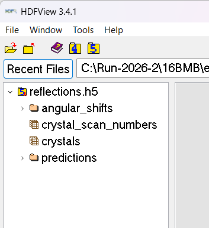
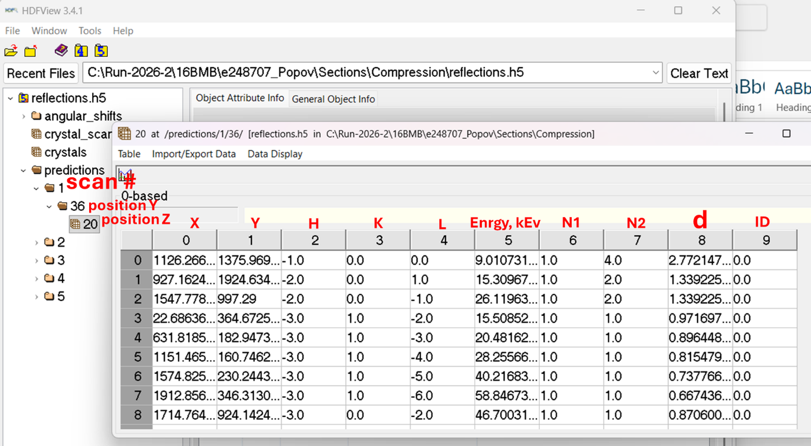
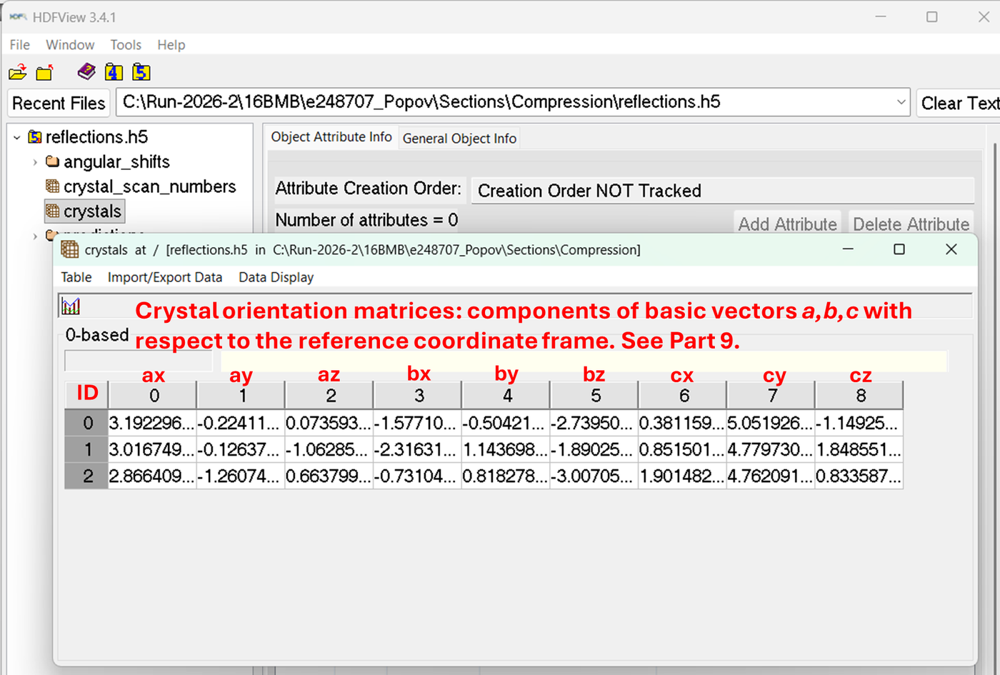
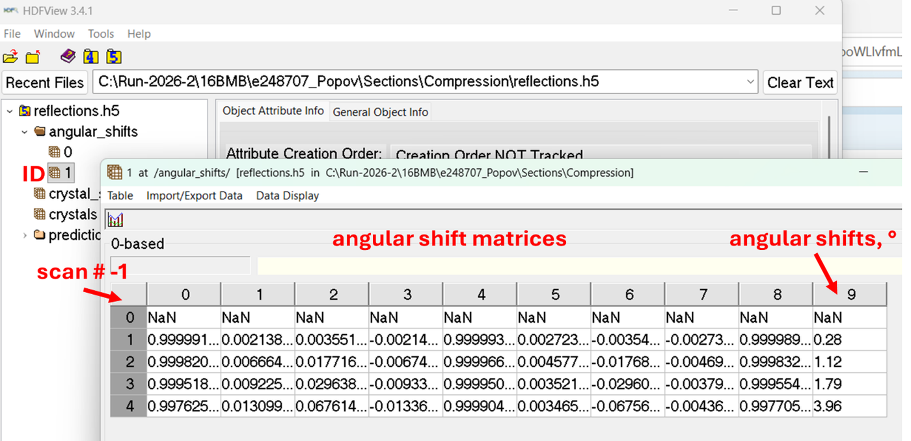
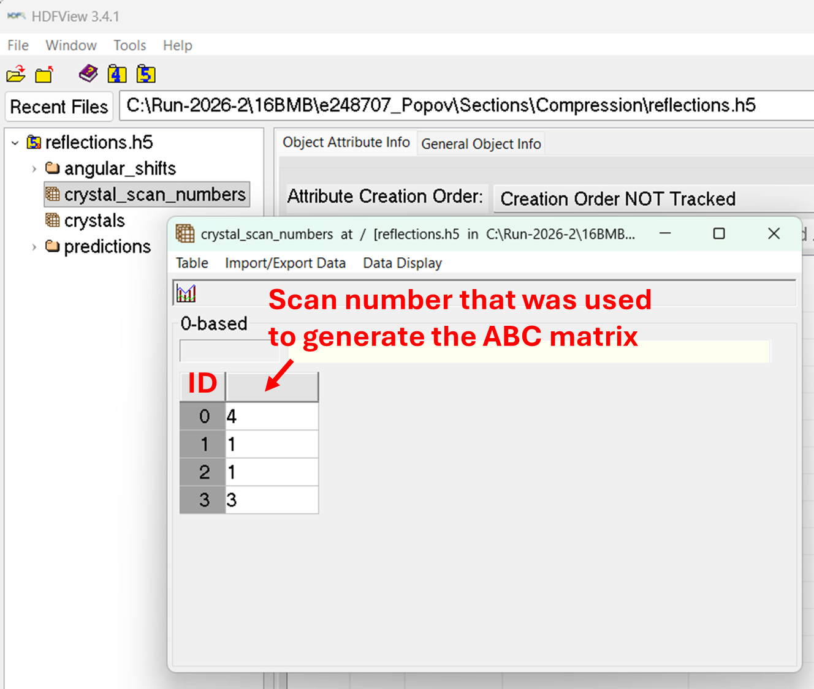
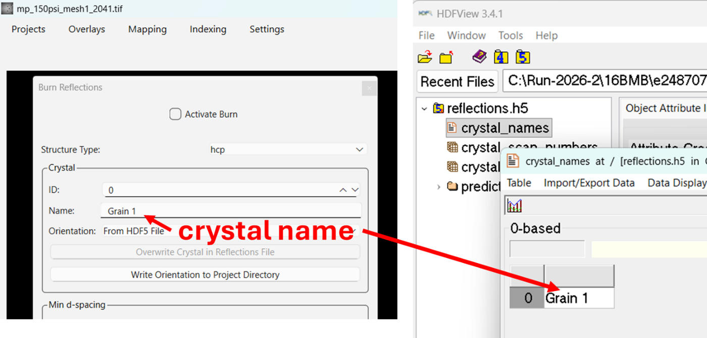
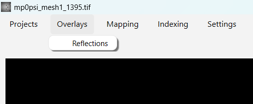
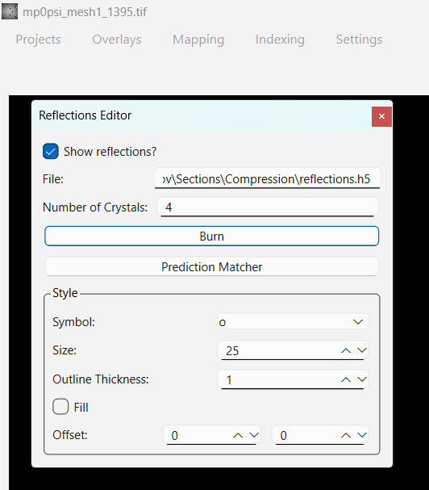
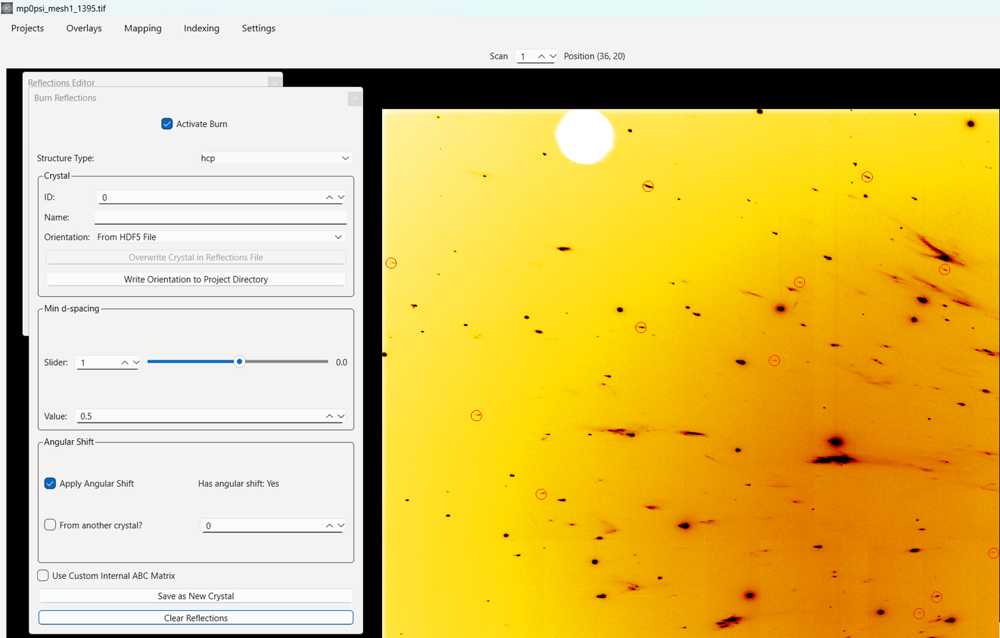
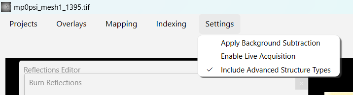

# Predicted Reflections

## The HDF5 file

Each section's results are stored in an HDF5 file located at
`<project directory>/Sections/<section name>/reflections.h5`. It holds:

- `/crystals` — the ABC matrix of each crystal (the components of the
  basis vectors a, b, c with respect to the reference coordinate frame,
  see [Calibrating Detector Geometry](calibration.md)), indexed by
  crystal ID (0-based);
- `/crystal_names` — the crystal names;
- `/crystal_scan_numbers` — the scan number that was used to generate
  each crystal's ABC matrix;
- `/angular_shifts` — for each crystal ID, one row per scan number
  (scan number − 1), holding the angular shift matrix and the angular
  shift in degrees; rows of NaN mean the crystal was not tracked on that
  scan;
- `/predictions` — the predicted reflections for each scan number and
  scan position: x, y, h, k, l, energy (keV), first and last order,
  d-spacing, and crystal ID.

HDF5 file must be closed during operations which update the file contents
(Find, Track/Refine…).

## Visualization of predicted reflections

Open **Overlays → Reflections**:

Click Burn. Set Structure Type, d-limit, check Apply Angular Shift if
needed, check Activate Burn.

## Setting structure types

If you click "Settings" at the top, there's a checkbox for "Include Advanced
Structure Types". If you check this, then the structure types in the burn
dialog will include all structure types, instead of just the basic ones.

To add new structure types, see [Adding New Structure Types](structure-types.md) or ask a beamline scientist.

## Using angular shifts from a different crystal

By using option Apply Angular Shift combined with option From another
crystal? one can visualize predicted reflections based on a crystal which
was tracked previously, provided the entire sample exhibits angular shifts
as a rigid body without changing relative orientations between crystals due
to cracking or bending. If the two crystals' ABC matrices were saved on
different scan numbers, the shift is recalculated relative to the scan where
the visualized crystal's matrix is saved. It only requires that the
reference crystal has been tracked at that scan and at the current one;
otherwise "Has angular shift" shows "No".
