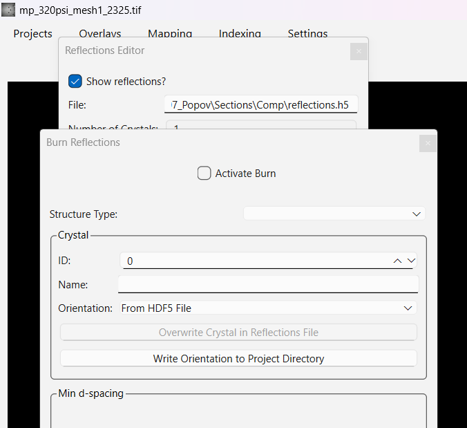
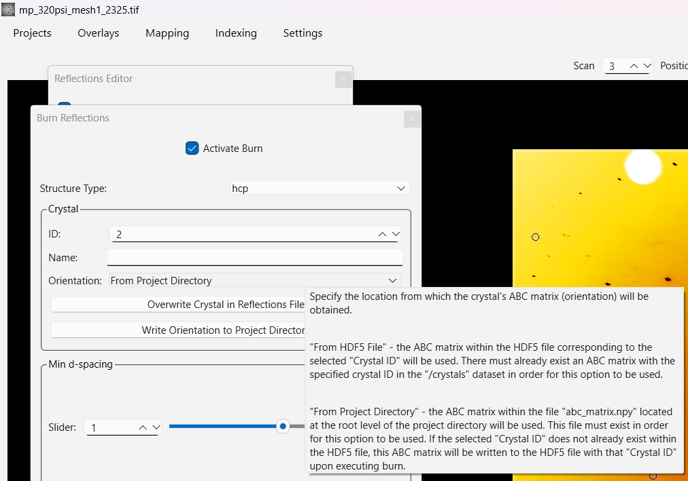

# Saving and Loading Data

Results are stored in the section's HDF5 reflections file, and several
of them can also be exported for use outside PolyLaue.

## The reflections file

Each section has one reflections file, located at
`<project directory>/Sections/<section name>/reflections.h5`. It holds
the predicted reflections, the ABC matrix (crystal orientation) and
the scan number it was determined on for each crystal, and the angular
shifts found by tracking.

The file is updated in place by Find, Track/Refine, and the Burn
Reflections dialog, so it must not be open in another program while
those run.

## ABC matrices

This option is primarily intended to use ABC matrices for theoretical
modelling, e.g. product or twin variants.

The Burn Reflections dialog (**Overlays → Reflections → Burn**) can move
a crystal's ABC matrix between the reflections file and the project
directory:

- **Write Orientation to Project Directory** saves the ABC matrix that
  the dialog is currently using to `abc_matrix.npy` (and an identical
  copy, `abc_matrix0.npy`) in the project directory. When
  **Orientation** is set to *From HDF5 File* and **Apply Angular
  Shift** is checked, the matrix is written with the angular shift for
  the current scan number applied; otherwise the stored matrix is
  written as is.
- Setting **Orientation** to *From Project Directory* reads
  `abc_matrix.npy` from the project directory instead of the
  reflections file. This is how an orientation is transferred between
  sections, or loaded from an external program.
- **Overwrite Crystal in Reflections File** stores the matrix the dialog
  is currently using into the reflections file for the selected crystal
  ID, together with the current scan number. Burning with a crystal ID
  that does not exist yet adds the crystal to the reflections file
  automatically, so this button is only needed to replace an *existing*
  crystal's matrix: for example, to update it with an orientation read
  from the project directory, or to store it with the current scan's
  angular shift applied (equivalent to *Replace ABC Matrix* in
  Track/Refine, but using the saved shift instead of tracking again).

The saved matrix is exactly what Find produces: the three basis vectors
of the direct lattice in the detector frame, as 9 values (a, b, c) in
the ABC matrix order. An applied angular shift is a pure rotation of
those vectors, so the frame, ordering, and cell parameters are
unchanged.

To import an ABC matrix from the project directory as a new crystal:
Change ID to a new one, set orientation From Project Directory and check
Activate Burn. A new entry will be made in HDF5 file using the current ABC
matrix. The new orientation saved in HDF5 file will be fully equivalent to
orientation determined with Indexing/Find in terms of further use of this
orientation for refinement and tracking. This capability can be beneficial
to move the same ABC matrix between different sections.

## Maps

In a map window (both region maps and HKL maps), **Save Map Data**
saves the map currently displayed to `map_data.npy` in the project
directory, as a 4D NumPy array: the first two axes are the scan
position (row, column), the last two the pixels of the region. The data
type follows the images (for example `uint16` for PerkinElmer images
and `int32` for Pilatus CdTe images). The file is overwritten on each
save, so rename it if several maps are needed.

## Picked points

In the point selection dialog (**Indexing → Select Points**), the
**Indexing** and **Refinement** choices save the points to
`indexing.xy` and `refinement.xy` in the project directory. Choosing
**Arbitrary File** opens a file dialog instead, so the points can be
saved anywhere.

The file is plain text with one point per line, as `x y` pixel
coordinates with three decimal places, and can be loaded with
`numpy.loadtxt`.
