# Viewing Data

Double-click a series in the navigator to open it in the main window.
The scan number is a spinbox at the top: use the Page Up/Page Down keys
or type in a scan number. Navigating within a scan (between scan
positions) is done with the arrow keys. The intensity scaling stays
while navigating through a series.

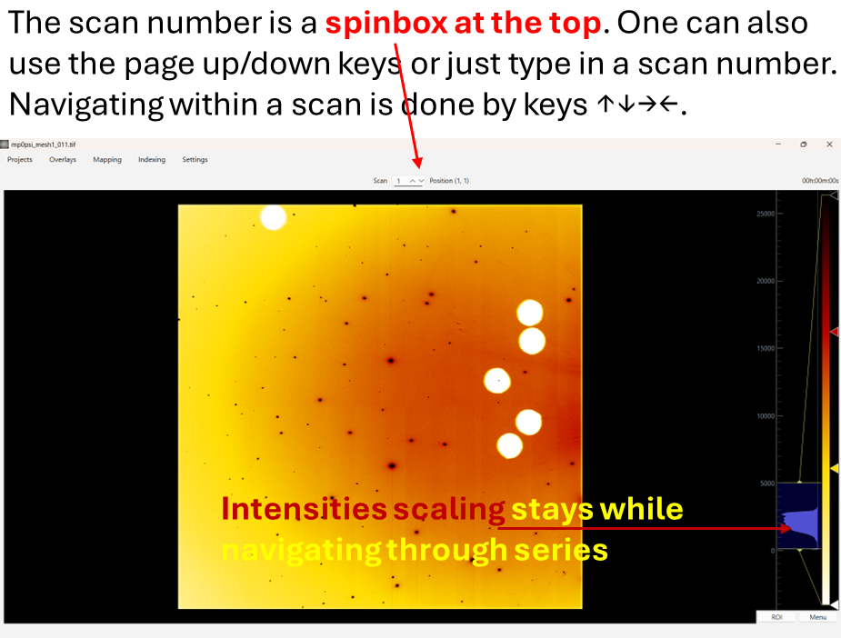

The label above the image shows the current series, scan number, and
scan position, and the status bar shows the pixel position and intensity
under the mouse (plus details of any predicted reflection being
hovered).

Right-clicking the image opens a context menu that, in addition to the
usual view options, provides:

- **set as background** — use the current image as the background image
  for the current series, or for every series in the current section.
- **perform saturation check** — mark saturated pixels.
- **set scan position coordinates** — configure the physical coordinates
  displayed for the scan positions.
- **set acquisition times** — configure computed frame times for the
  current section (see below).
- **set frame as time zero** — display frame times relative to the
  current frame (see below).

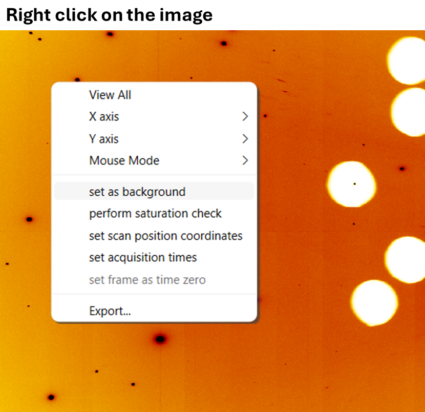

## Background subtraction (optional)

Background subtraction can be toggled via **Settings → Apply Background
Subtraction**.

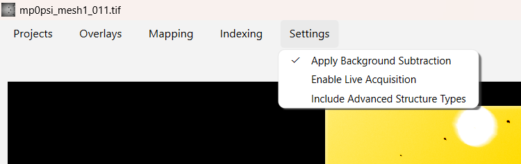

To choose the background image, right-click the image and click **set
as background**, then choose whether it applies to the current series
or to every series of the current section:

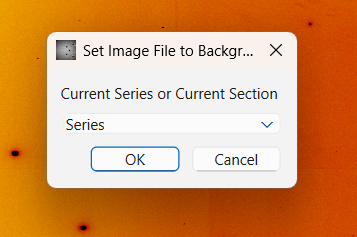

Alternatively, the background image can be specified in the Series
Editor:

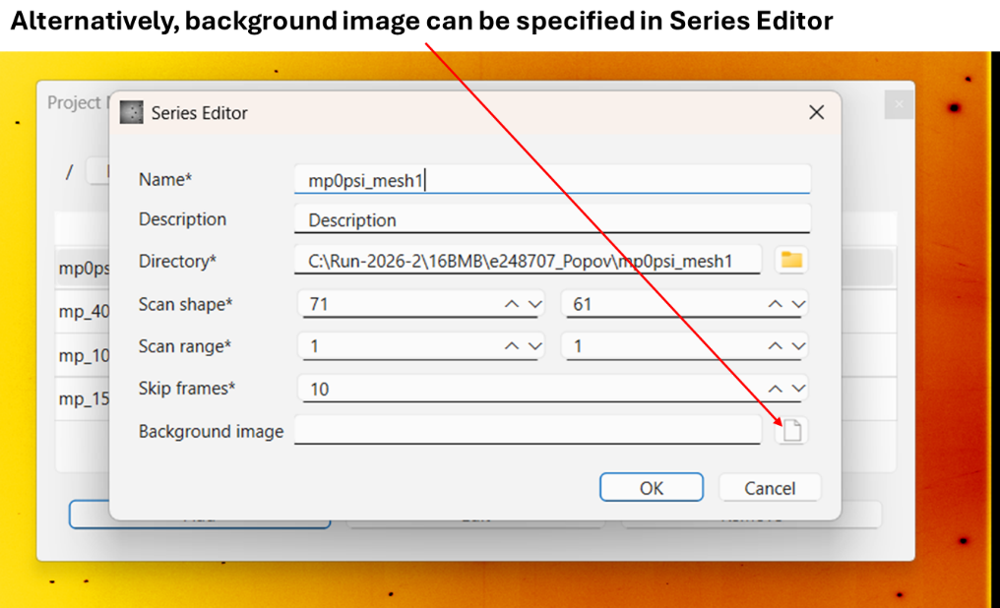

## Frame times

The main window displays a time for the currently viewed frame, in the
top-right corner. The time comes from one of two sources:

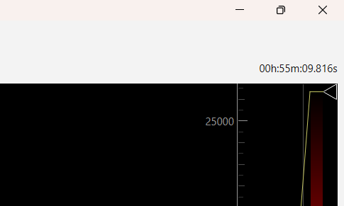

- **Computed acquisition times.** If acquisition intervals are
  configured and applied for the current section, the time of each frame
  is computed from the frame period, the break between rows, and the
  break between scans. By default it is relative to the first frame of
  the current series.
- **File modification times (mtime), the default.** The displayed time
  is the mtime of the currently viewed file, relative to the first file
  of the section. A file is considered "modified" when it was written;
  copying the file does not change its mtime, so it still points to the
  original time when the file was written. The only thing that changes
  the mtime is modifying the contents of the file.

### Acquisition times

For acquisition times, right-click the image and click "set acquisition
times". The times only take effect while the "Apply acquisition times"
checkbox is checked; unchecking it goes back to the file timestamps.

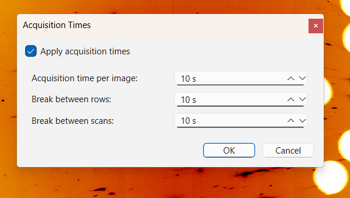

Once applied, one can right-click and click "set frame as time zero"; frames
before it get negative times. The intervals are stored per section, in
seconds. Times are rounded down to microseconds, and time zero resets to the
series' first frame whenever one switches series.

The intervals and the checkbox are stored per section. A newly created
section starts with the checkbox unchecked; as a convenience, the
interval values from the last section you configured are pre-filled.

### Time zero

Right-click any frame and choose **set frame as time zero** to display
all frame times relative to that frame. This works with both time
sources — computed acquisition times and file modification times — and
each source keeps its own time zero, so toggling **Apply acquisition
times** does not mix them.

The time zero resets to the default (the first frame of the series, or
the first file of the section, respectively) whenever a different series
is loaded, and the computed time zero also resets when the interval
values are changed.

## Scan position coordinates

One accesses the settings by right-clicking the image, and there is a "set
scan position coordinates" context menu item that one clicks:

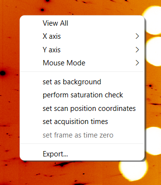

When one clicks it, it brings up the following menu:

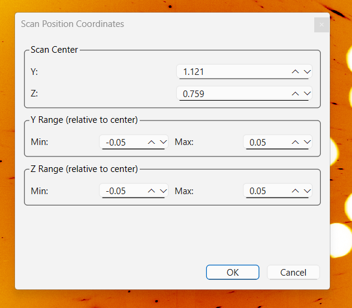

You can see the Y and Z specified in the top-left corner. This changes when
you change scan positions. Internally, it is saved within a series.

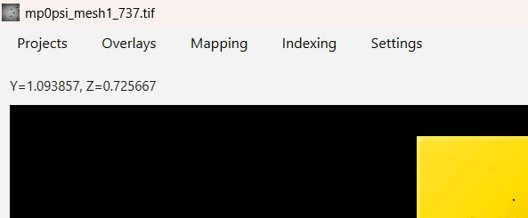

The math for determining Y or Z for a scan position is as follows: (scan_pos
- 1) x step_size + scan_center +min. The step size is calculated via (max -
min) / (num_points - 1). The number of points in each direction is taken
from the
scan shape. The units are arbitrary: enter the parameters in the same
units as in the data collection software.

## Live acquisition

Live acquisition is toggled via **Settings → Enable Live Acquisition**.

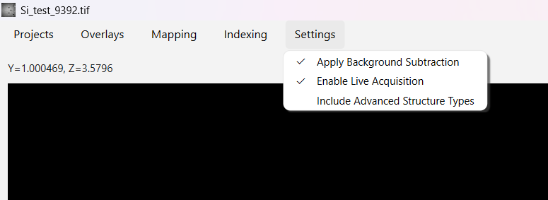

If Enable Live Acquisition is active PolyLaue automatically checks for the
newest scan number that is available and jumps to it. It also verifies that
it can actually load that newest file, in case the file is in the process of
being written (and can't be read yet). The software also takes into account
the fact that accessing the file system through a network drive could be
slower and cause issues.

## Saturation check

Right-click the image and click **perform saturation check**, then
enter the saturation level:

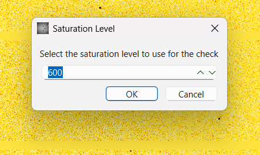

Pixels above that level are marked on the image, and a warning reports
how many there are. Closing the warning restores the colormap levels
and clears the markers.

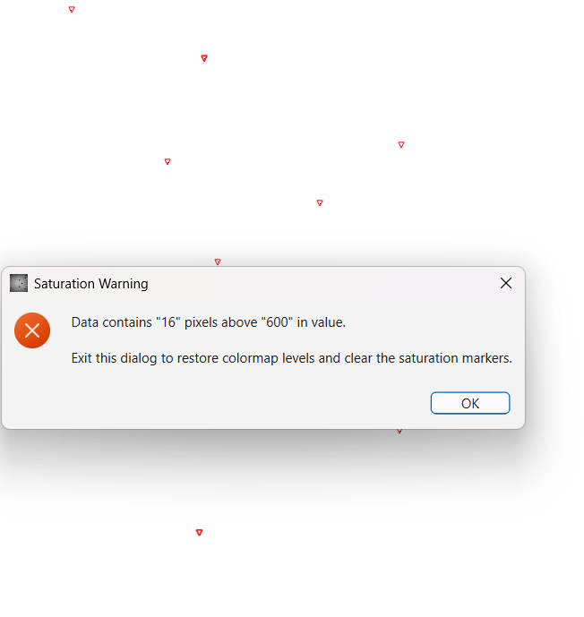

